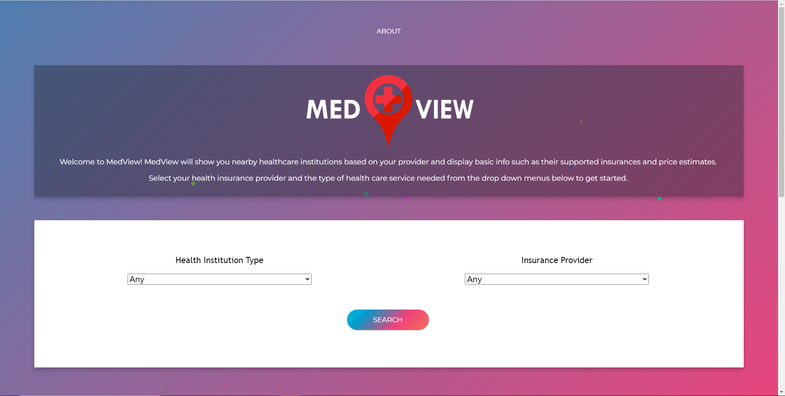
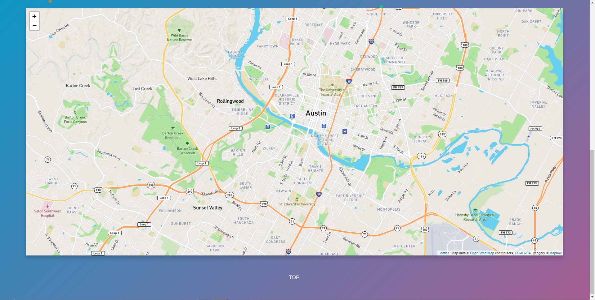
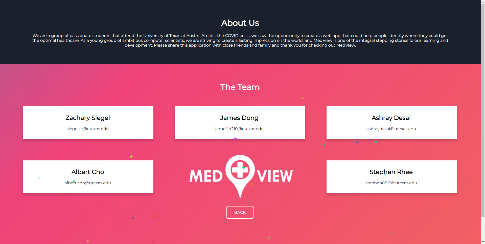

## MedView

### Setup
 - Clone this repository
 - Install global dependencies: `sudo apt install python3-virtualenv nodejs npm libpq-dev python3-dev`
 - Change working directory to repo folder
 - `virtualenv .`
 - `source bin/activate`
 - `./installdeps`

### Contribute
 - Run python tests: `pytest`
 - Build JavaScript: `npm run build`
 - Start Server: `npm start` or `python3 main.py`
 
 ## Previews
 
 
 
